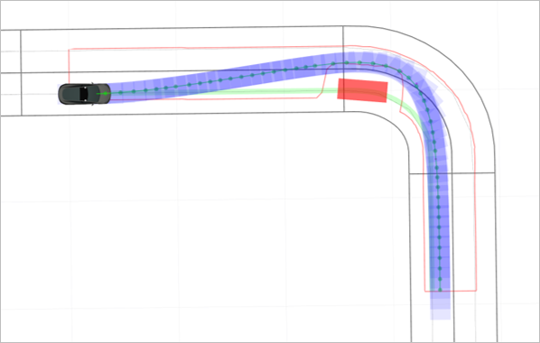
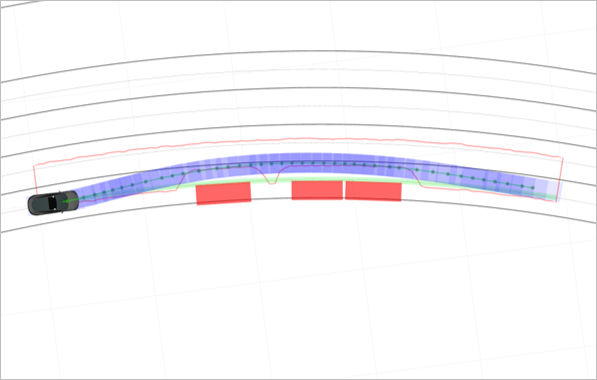
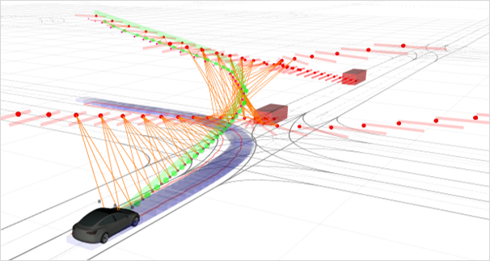
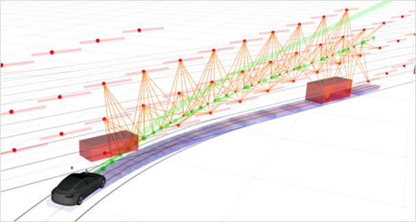

# STEB-Planner
STEB-Planner is a spatio-temporal elastic bands-based trajectory planner for autonomous vehicles using semantic graph  optimization

> The paper of this method is submitted to the IEEE Robotics and Automation Letters (RA-L)


## Performance Display
### Static obstacle avoidance

<table border="0" width="100%">
  <tr>
    <td align="center" width="50%">
      
      <br>
      <em>Scenario 1: Static Obstacle Avoidance</em>
    </td>
    <td align="center" width="50%">
      
      <br>
      <em>Scenario 2: Static Obstacle Avoidance</em>
    </td>
  </tr>
</table>


### Dynamic traffic Interaction

<table border="0" width="100%">
  <tr>
    <td colspan="2" align="center" width="100%">
      
      <br>
      <em>Scenario 3: Overtaking a slow car ahead</em>
    </td>
  </tr>

  <tr>
    <td  align="center" width="50%">
      
      <br>
      <em>Scenario 4: Unprotected Left Turn</em>
    </td>
    <td align="center" width="50%">
      
      <br>
      <em>Scenario 5: Merge Into the Traffic</em>
    </td>
  </tr>

</table>
The gif some other scenes will be uploaded later


## Installation

### Prerequisites

Our software is developed and tested in Ubuntu20.04 with ROS2 galactic. Follow [this link](https://docs.ros.org/en/galactic/Installation.html) to install galactic.

### Simulation environment

We use **Carla-0.9.15** as the simulator (download via this [link](https://github.com/carla-simulator/carla/releases/tag/0.9.15)).

To use the Carla PythonAPI, you need to export the path or install it

```bash
export CARLA_ROOT=<path-to-carla>
export PYTHONPATH=$PYTHONPATH:/carla_directory/PythonAPI/carla/dist/carla-0.9.15-py3.7-linux-x86_64.egg
```


## Installation
### Required Library
- Eigen3
- PCL
- OpenCV

### Download & Compile
```bash
# Download
cd ~/your_workspace/src
git clone https://github.com/heshanchuan/STEB-Planner.git

# Compile
cd ../
source /opt/ros/galactic/setup.bash
colcon build  --symlink-install  --cmake-args -DCMAKE_EXPORT_COMPILE_COMMANDS=ON -DCMAKE_BUILD_TYPE=Release

```


## Usage example

```bash
source install/setup.bash
ros2 launch steb_planner steb_planner_test.launch.xml
```


## Release History
Notes: 1.0.0 will be our first elegant version.
* 0.1
    * CHANGE: First upload readme and some multimedia files


## Contributing

1. Fork it (<https://github.com/heshanchuan/STEB-Planner/fork>)
2. Create your feature branch (`git checkout -b feature/fooBar`)
3. Commit your changes (`git commit -am 'Add some fooBar'`)
4. Push to the branch (`git push origin feature/fooBar`)
5. Create a new Pull Request

## License

The source code is released under [MIT](https://opensource.org/licenses/MIT) license.

## Disclaimer

This is research code, it is distributed in the hope that it will be useful, but WITHOUT ANY WARRANTY; without even the implied warranty of merchantability or fitness for a particular purpose.